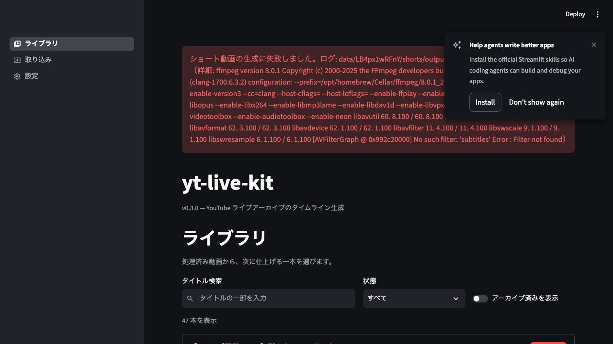
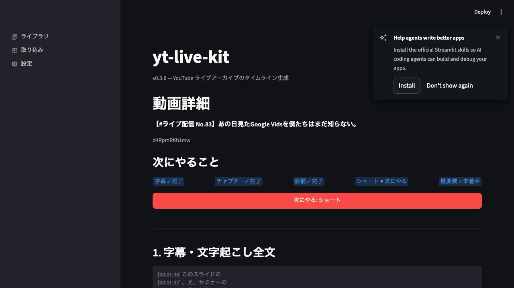
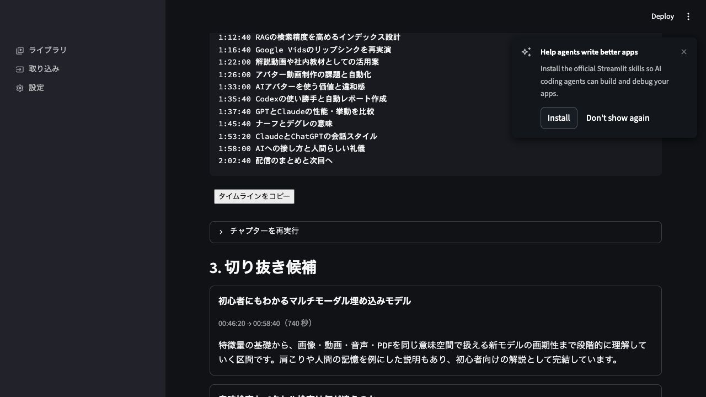
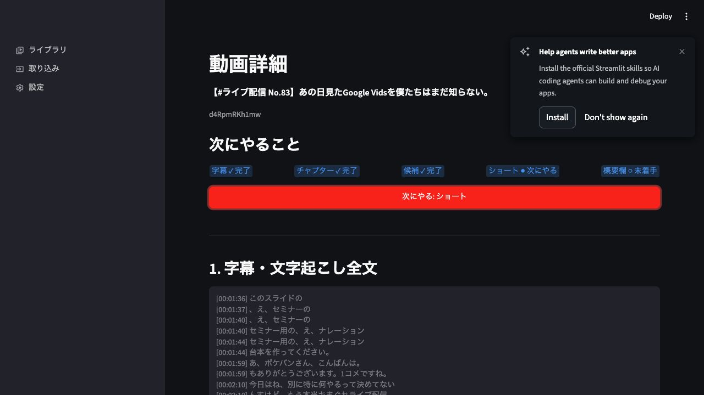
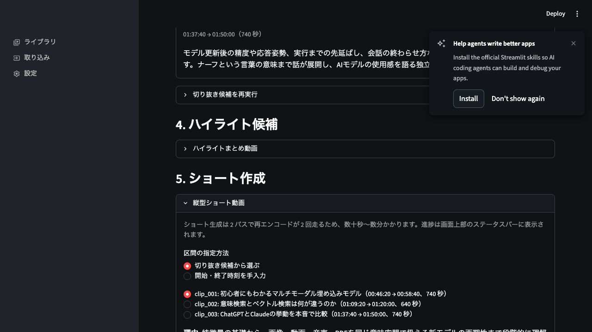
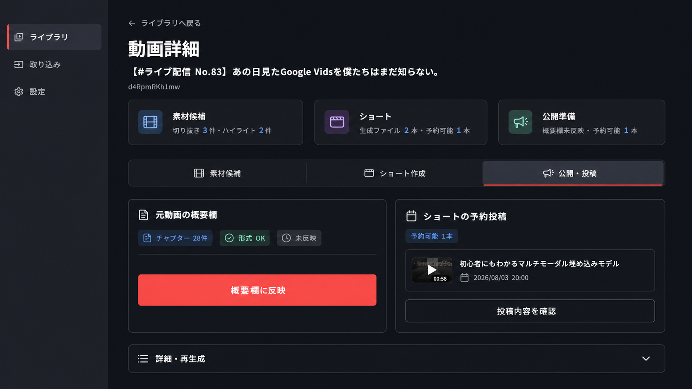

# 動画詳細ページ UX 監査

実施日: 2026-08-01

## 監査範囲

- ライブラリから動画を選ぶ
- 動画詳細で現在の進捗を把握する
- 「次にやる: ショート」からショート作成を始める
- ショート作成領域まで到達する

## 総評

最大の問題はページ階層そのものではなく、1 画面に全成果物と全操作を縦積みし、その中をさらに `expander` で入れ子にしている点である。ステッパーは次の作業を示しているが、CTA は該当作業へ画面を切り替えず、下方の `expander` を開くだけなので、行動の結果が見えない。

なお、現行 FR-17 は全操作をパイプライン順のセクションとして 1 画面に並べることを明記している。選択中の作業だけを表示する構成へ変える場合は、実装前に `requirements-v3.md` と `execution-plan-v3.md` を改訂する必要がある。

## 画面ごとの確認

### 1. ライブラリから動画を選ぶ — 注意

- 47 本のカードを縦に並べるため、下方の動画を開くまでの移動量が大きい。
- 過去ジョブの長いエラーがページ全体の先頭を占有し、現在の動画選択を邪魔している。
- 動画タイトル、状態、開く操作は確認しやすい。

### 2. 動画詳細の入口 — 良好だが改善余地あり

- 動画タイトル、動画 ID、5 段階の進捗、次の CTA は上部にまとまっている。
- 完了、次、未着手を文字でも示しており、色だけに依存していない。
- 直後に 400px の全文文字起こしが始まり、次の作業より過去成果物が視界を占有する。
- 小さい青色バッジは、実環境でコントラスト確認が必要。

初回の遷移ではライブラリのスクロール位置を引き継ぎ、動画詳細の途中から表示された。

### 3. 次の CTA を押す — 不調

- CTA 押下後も上部に残り、見た目の変化がほぼない。
- 実装上はショート作成 `expander` が開くが、該当箇所への移動やフォーカス移動がない。
- ユーザーは処理開始、画面遷移、失敗のどれなのか判断しにくい。
- 同じ CTA がステップごとにページ遷移、確認ダイアログ、`expander` 展開、外部 API プレビュー開始という異なる動作をするため、押した結果を予測できない。

### 4. ショート作成へ到達 — 不調

- 1280 × 720 の監査環境では、ショート作成見出しを表示した時点のメイン領域のスクロール量を 2,418px と実測した。
- 「5. ショート作成」の中に「縦型ショート動画」があり、その中に区間指定、単体生成、サブ区間、まとめて生成が続くため、見出しと作業単位が一致しない。
- 前段の切り抜き候補を再表示したまま、同じ候補をショート作成内でも再選択するため、情報が重複する。
- ステッパーの「候補」は切り抜き候補またはハイライト候補のどちらか一方で完了になるが、本文では両者が別セクションであり、役割の違いが分かりにくい。

## 推奨する情報設計

### 結論

動画詳細を「処理パイプラインを上から全部見せるページ」から、「実際に行う仕事を選んで進めるページ」へ変更する。

主画面に残す作業は次の 3 つだけとする。

1. **素材候補** — 切り抜き候補とハイライト候補を確認する
2. **ショート作成** — 候補選択からテロップ確認、生成までを進める
3. **公開・投稿** — 元動画の概要欄反映と、生成済みショートの予約投稿を行う

字幕全文、チャプター本文、コピー、再生成、ログ、元動画削除は日常的な主作業ではないため、ページ最下部の **詳細・再生成** へ移す。

チャプターは独立した作業から外し、**概要欄反映の入力データ** として扱う。通常時は本文を見せず、「生成済み・形式 OK・28 件」のような状態だけを公開・投稿ワークスペースへ表示する。

### 完成イメージ

このイメージは、3 つのワークスペースのうち「公開・投稿」を選択した状態を表している。チャプター本文は表示せず、概要欄へ反映できる状態かどうかだけを短く示し、元動画の概要欄反映とショートの予約投稿を別カードに分けた。日常的に触らない字幕全文、チャプター本文、再生成、ログ、元動画管理は、画面最下部の「詳細・再生成」にまとめる。

画像は推奨する情報構造と画面内の優先順位を共有するための完成イメージである。実装時は既存コンポーネントに合わせて余白や文字サイズを調整するが、表示順、3 ワークスペース、チャプターの扱い、主要 CTA の位置はこの構成を基準とする。

### 推奨する画面全体の構成

| 順序 | 領域 | 常時表示 | 役割 |
|------|------|----------|------|
| 1 | 動画ヘッダー | はい | ライブラリへ戻る、動画タイトル、動画 ID、現在のジョブ状態 |
| 2 | 状態サマリー | はい | 素材候補数、ショート本数、概要欄反映状態を短く表示 |
| 3 | 作業切り替え | はい | 素材候補、ショート作成、公開・投稿を切り替える |
| 4 | 選択中のワークスペース | はい | 選択した 1 作業だけを描画する |
| 5 | 詳細・再生成 | いいえ | 字幕、チャプター全文、コピー、再生成、ログ、元動画管理 |

画面上部に現在の動画を示す情報と 3 つの状態カードを置き、その下に `st.segmented_control` で作業切り替えを配置する。状態カードは進捗把握だけに使い、操作の入口は作業切り替えへ一本化する。`st.tabs` はプログラムから選択状態を切り替えにくいため、動画ごとの選択状態を session state で保持しやすい `st.segmented_control` を第一候補とする。

### 1. 動画ヘッダー

表示内容は次に絞る。

- 「ライブラリへ戻る」
- 動画タイトル
- 動画 ID
- 実行中ジョブがある場合だけ、処理名と進捗
- エラーがある場合は 1 行の要約と「詳細を見る」

現在のような ffmpeg の出力全文をページ先頭へ直接表示しない。ユーザー向けには「ショート生成に失敗しました」と対象動画・再試行方法だけを示し、技術ログは詳細領域へ移す。

### 2. 状態サマリー

現在の 5 段ステッパーは廃止し、ユーザーの成果に対応する 3 つのカードへ置き換える。

| カード | 状態表示例 |
|--------|------------|
| 素材候補 | 切り抜き 3 件・ハイライト 2 件 |
| ショート | 生成ファイル 2 本・予約可能 1 本 |
| 公開準備 | 概要欄未反映・予約可能 1 本 |

カード内にはボタンを置かず、カード全体もクリック可能にしない。カードと作業切り替えの両方を入口にすると操作可能範囲が分かりにくくなるため、カードは状態の読み取り、`st.segmented_control` は移動という役割に分ける。

字幕とチャプターは「準備データ」であり、ユーザーの作業ステップではない。欠損またはエラーがある場合だけ、該当カード内に「準備データに問題があります」と表示する。

「生成ファイル」と「予約可能」は別の指標とする。

- **生成ファイル** — `shorts/output` に存在する全 mp4。単体手動生成を含む
- **予約可能** — 最新の検証済み量産 manifest にある成功 item のうち、出力ファイルが存在するもの

YouTube 予約投稿へ誘導する判定には「予約可能」を使う。生成ファイルが存在しても、予約対象 manifest に含まれない場合は「生成済みですが予約対象に追加されていません」と表示し、予約投稿フォームを出さない。

### 3. 作業切り替え

`st.segmented_control` の選択肢は次の 3 つとする。

- 素材候補
- ショート作成
- 公開・投稿

選択値は動画 ID ごとの session state に保持する。作業を切り替えてもジョブ開始や YouTube 更新は行わず、対象ワークスペースを開くだけにする。

初期選択は次の規則で決める。

1. 字幕成果物または `PipelineResult` を読み込めない場合は、通常ワークスペースを出さず回復用の空状態を表示
2. 当該動画のジョブが進行中なら、そのジョブに対応するワークスペース
3. 候補が 0 件なら素材候補
4. 候補があり予約可能ショートが 0 本ならショート作成
5. 予約可能ショートが 1 本以上なら公開・投稿
6. ユーザーが同じ動画で作業を切り替えた後は、最後に選んだワークスペースを維持

動画 A と動画 B の状態を混ぜないため、選択状態の key には必ず動画 ID を含める。

### 3-A. 字幕成果物を読み込めない場合

`load_result_from_disk()` が `None` の場合は、素材候補、ショート作成、公開・投稿を描画しない。通常画面の一部に警告を混ぜるのではなく、動画タイトルの下へ回復専用の空状態を表示する。

- 「保存済みの字幕成果物を読み込めませんでした」
- 想定される原因の短い説明
- 「取り込みで再処理」CTA
- 「詳細を見る」で動画 ID、存在する成果物、読込エラーを表示

「取り込みで再処理」は取り込みページを開き、可能なら対象動画 URL または動画 ID を引き継ぐ。ボタンを押した時点では再処理ジョブを開始しない。

### 4. 素材候補ワークスペース

切り抜き候補とハイライト候補を同じ「ショート素材」として扱い、役割の違いを短く説明する。

| 種類 | 役割 | 表示 |
|------|------|------|
| 切り抜き候補 | 元配信から見どころとなる長めの区間 | タイトル、開始・終了、尺、理由 |
| ハイライト候補 | ショート向けに絞り込んだ区間または複数区間 | タイトル、区間一覧、合計尺、理由 |

両方がある場合だけ、ワークスペース内で「切り抜き候補／ハイライト候補」を切り替えられるようにする。候補カードから、そのままショート作成対象へ追加できるようにし、ショート作成画面で同じ候補を最初から探し直させない。

候補の生成・再生成は主 CTA にせず、候補が無い場合の空状態、またはワークスペース末尾の補助操作として置く。既存成果物の上書き確認ダイアログは維持する。

#### 素材候補からショート作成へ引き継ぐ状態

候補カードの選択をショート作成へ引き継ぐ場合は、既存の shorts queue snapshot と混同しない。次の UI 状態を動画 ID 別に持つ。

- 候補ソース
- 選択した候補 ID の配列
- 候補ファイル全体の fingerprint
- 選択順

この状態は session state のみとし、ジョブ仕様や確定済み台本としては扱わない。ショート作成を開いたときに、該当候補を事前選択した状態で既存フォームを表示し、ユーザーが「選択内容を確定」を押した時点で初めて正式な shorts queue snapshot を作る。

候補ファイルの fingerprint が変わった場合、候補が再生成された場合、選択 ID が現在の候補に存在しない場合は、引き継ぎ選択と未確定 snapshot を破棄して日本語で再選択を案内する。素材候補内でソースを切り替えても、切り抜き候補とハイライト候補の選択を別々に保持する。

### 5. ショート作成ワークスペース

現在の「5. ショート作成 → 縦型ショート動画 → 単体作成／サブ区間／まとめて生成」という入れ子を廃止する。主導線は量産フローへ一本化する。

1. 生成対象を選ぶ
2. 個別生成または連結生成を選ぶ
3. レイアウトとテロッププリセットを選ぶ
4. 対象ごとにテロップ台本とメタデータを生成・修正する
5. 全対象を確定する
6. まとめて生成する
7. 結果動画を確認する

この 7 段階はショート作成ワークスペース内の局所フローとして扱う。ページ全体の階層を増やさないため、未到達の工程をすべて同時表示せず、現在必要な工程と完了済みの短い要約だけを表示する。

開始・終了時刻を手入力して 1 本だけ作る既存ルートは「1 本だけ手動作成」という補助領域へ移す。通常の利用では「候補からまとめて生成」を既定とする。

### 6. 公開・投稿ワークスペース

元動画とショート動画への公開操作を 1 か所へ集約する。ただし、誤操作を避けるためカードを分ける。

#### 元動画の概要欄

通常表示するのは次の情報だけとする。

- チャプター生成済み／未生成
- 形式 OK／形式エラー
- チャプター件数
- 概要欄へ反映済み／未反映
- 「概要欄に反映」ボタン

**チャプター本文は通常表示しない。** 「概要欄に反映」を押した場合は、既存の安全契約を維持し、更新前と更新後を `st.dialog(width="large")` で必ず比較表示する。ダイアログの確定ボタンを押すまで YouTube は更新しない。

| チャプター状態 | 表示と動作 |
|------------------|------------|
| 未生成 | 「チャプターがありません」を表示し、概要欄反映を無効化。「生成する」を表示 |
| 形式エラー | エラー要約を表示し、概要欄反映を無効化。「再生成」または詳細確認を表示 |
| 生成済み・正常 | 「形式 OK・28 件」のように表示し、概要欄反映を有効化 |
| 最新のチャプターを反映済み | 完了状態を表示し、再反映は secondary 操作に格下げ |
| 反映後にチャプターが変更された | 「チャプター更新あり・要再反映」を表示し、反映 CTA を再び primary にする |
| 旧形式の反映履歴だけがある | 「過去に反映済み・最新性不明」を表示し、現在内容のプレビューを案内 |

`validate_chapters()` による存在・形式確認、`fetch_video_snippet()`、更新前後プレビュー、確定時だけの `update_video_description()` という安全契約は変更しない。完了記録は YouTube 更新成功後だけ保存する順序を維持したまま、`mark_description_applied()` を fingerprint と反映日時を受け取る形へ拡張する。

現在の `description_applied_videos.json` は動画 ID の配列だけなので、チャプター再生成後も反映済みに見える。新規成功記録では、動画 ID ごとに正規化済みチャプター本文の SHA-256 fingerprint と反映日時を保存する形式へ移行する。

既存配列は読み込み互換を維持し、該当動画を「過去に反映済み・最新性不明」として扱う。現在のチャプター fingerprint と保存済み fingerprint が一致する場合だけ「最新のチャプターを反映済み」と表示する。fingerprint 計算と保存は UI 固有の軽量状態として `_local_settings.py` に置き、YouTube API サービスの安全契約は変更しない。

#### ショートの予約投稿

最新の検証済み量産 manifest にある予約可能ショートだけを表示し、投稿対象、公開予定時刻、タイトル、説明文、タグ、視聴者設定、合成メディア設定、同意状態を確認してから予約確定する。既存の private 固定、未来時刻、通知なし、確認ダイアログ、二重実行防止は維持する。

予約可能ショートが 0 本の場合は設定フォームを表示しない。生成ファイルも 0 本なら「先にショートを作成してください」と「ショート作成を開く」を表示する。単体手動生成ファイルだけがある場合は「生成済み動画はありますが、予約投稿できる量産結果がありません」と表示し、量産フローを開く導線を出す。

### 7. 詳細・再生成

ページ最下部に `st.expander("詳細・再生成", expanded=False)` を 1 つ置き、次を集約する。

- 字幕・文字起こし全文
- 全文コピー
- チャプター本文
- タイムラインコピー
- チャプター再生成
- 切り抜き候補再生成
- ffmpeg・ジョブの技術ログ
- 元動画と中間ファイルの管理

ここでは `expander` の使用を許容する。いずれも日常の主作業ではなく、確認・復旧・保守のための補助操作だからである。再生成と削除の確認ダイアログは維持する。

### 現行構成からの移動表

| 現行セクション | 推奨配置 | 変更内容 |
|----------------|----------|----------|
| 次にやることステッパー | 状態サマリー | 5 工程から 3 成果カードへ変更 |
| 字幕・文字起こし全文 | 詳細・再生成 | 初期表示から外す |
| チャプター | 公開・投稿＋詳細・再生成 | 状態と反映 CTA は公開、本文は詳細へ分離 |
| 切り抜き候補 | 素材候補 | ハイライト候補と役割を整理 |
| ハイライト候補 | 素材候補 | 切り抜き候補と同じ素材ワークスペースへ統合 |
| ショート作成 | ショート作成 | 外側 expander を除去し、量産フローを主導線化 |
| 概要欄反映 | 公開・投稿 | チャプター状態と同じカードへ統合 |
| YouTube 予約投稿 | 公開・投稿 | 元動画概要欄とは別カードで表示 |
| 元動画と中間ファイルの管理 | 詳細・再生成 | 保守操作として最下部へ移動 |

### CTA の動作契約

作業切り替えはワークスペースを開くだけとし、副作用を発生させない。実処理は、対象ワークスペース内で内容を確認した後の明示ボタンだけから開始する。

| CTA | 押した直後の動作 | 副作用 |
|-----|------------------|--------|
| 素材候補／ショート作成／公開・投稿 | 対応するワークスペースへ切り替える | なし |
| 取り込みで再処理 | 対象情報を引き継いで取り込みページを開く | なし |
| 概要欄に反映 | 更新前後プレビューを開く | まだなし |
| プレビュー内の確定 | YouTube 概要欄を更新する | あり |
| まとめて生成 | 必要なら上書き確認を開き、確定後にジョブ開始 | 確定後のみあり |
| 予約投稿を確定 | 投稿内容を再検証し、確定後に予約ジョブ開始 | 確定後のみあり |

これにより、「次にやる」を押したときに、ページ遷移、ダイアログ、`expander` 展開、API プレビュー開始が混在する現状を解消する。

## 要件・実行計画の修正案

この変更は現在の FR-17 と U2 の「全操作をパイプライン順に 1 画面へ並べる」という前提を変えるため、コード変更より先に要件と実行計画を更新する。

### `requirements-v3.md`

- FR-17 の処理を「動画ごとの 3 ワークスペース構成」へ改訂する
- FR-17 の出力から 5 段ステッパーを外し、状態サマリーと作業切り替えへ変更する
- チャプターは概要欄反映の入力データとし、本文は詳細領域でのみ表示すると明記する
- 完了済みの再実行、削除、技術ログは詳細・再生成へ集約すると明記する
- AC-19 を新しい構成、CTA 契約、チャプター状態表示に合わせて更新する
- FR-21 の差分プレビューと YouTube 更新安全契約は維持するが、「ステッパー CTA と通常ボタン」という入口の記述を「公開・投稿ワークスペースの概要欄ボタン」に改訂する

### `execution-plan-v3.md`

- 完了済み U2 のチェックを書き換えず、新しい UI 改善タスクを追加する
- タスクには要件改訂、UI 再構成、状態移設、テスト、実ブラウザ確認を含める
- `services/` の変更は原則不要とする。ただし、概要欄反映の最新性を判定する fingerprint 付き UI ローカル状態と、動画別エラー通知状態の追加は UI 層の変更範囲へ明記する
- 変更後の実画面で、初期表示、3 ワークスペース、概要欄プレビュー、予約投稿確認を確認する

## 実装時の変更対象

| ファイル | 主な変更 |
|----------|----------|
| `docs/requirements-v3.md` | FR-17、AC-19、用語の改訂 |
| `docs/execution-plan-v3.md` | 新 UI 改善タスクと Done 条件の追加 |
| `src/yt_live_kit/ui/views/video_detail.py` | ステッパー廃止、状態サマリー、3 ワークスペース、条件描画、詳細領域 |
| `src/yt_live_kit/ui/views/_local_settings.py` | 概要欄反映記録を fingerprint・反映日時付きへ拡張し、旧配列を互換読込 |
| `src/yt_live_kit/ui/views/highlights.py` | 素材候補内から呼びやすい表示境界へ整理 |
| `src/yt_live_kit/ui/views/shorts.py` | 外側 expander の除去、量産主導線と単体補助導線の分離 |
| `src/yt_live_kit/ui/components/shorts_queue.py` | 引き継ぎ選択から正式 snapshot を作る境界、現在工程だけを見せる表示整理、既存状態契約の維持 |
| `src/yt_live_kit/ui/components/upload.py` | 番号付き見出しを外し、公開・投稿カード内へ統合 |
| `src/yt_live_kit/ui/app.py` | 生のエラー全文表示をやめ、要約通知へ変更 |
| `src/yt_live_kit/ui/state.py` | 動画 ID 別の構造化エラー通知と保持上限を追加 |
| `src/yt_live_kit/ui/components/status_bar.py` | 長いエラーの要約表示と、対象動画への導線 |
| `tests/test_ui_video_detail_page.py` | 状態サマリー、初期選択、CTA、チャプター状態、詳細領域 |
| `tests/test_ui_state.py` | 動画別エラー通知、保持上限、他動画との分離 |
| `tests/test_ui_shorts.py` | expander 依存の期待値を新しい表示契約へ変更 |
| `tests/test_ui_shorts_queue.py` | 工程表示を変えても確定・上書き・job ID 分離が維持されることを確認 |
| `tests/test_ui_upload.py` | 公開・投稿内への移設後も安全契約が維持されることを確認 |

## 実装順序

1. 要件と実行計画を改訂する
2. 動画詳細の状態計算を、5 段ステッパーから状態サマリー用へ変更する
3. 3 ワークスペースと動画 ID 別の選択状態を実装する
4. 字幕成果物を読み込めない場合の回復用空状態を実装する
5. 字幕、チャプター、再生成、ログ、元動画管理を詳細領域へ移す
6. 素材候補を統合し、動画 ID 別の候補引き継ぎ状態を実装する
7. ショート作成から外側の入れ子を外し、量産フローを主導線にする
8. 概要欄反映記録を fingerprint 付きへ移行し、概要欄反映と予約投稿を公開・投稿へ統合する
9. 構造化エラー通知と詳細ログ表示を実装する
10. UI ユニットテストを更新する
11. `uv run pytest` を実行する
12. 実ブラウザで主要 3 ワークスペース、回復空状態、確認ダイアログを確認する

## 受け入れ条件

- 初期表示の 1 画面内で動画タイトル、素材候補数、ショート本数、概要欄反映状態が分かる
- 初期表示で字幕全文とチャプター本文を描画しない
- 字幕成果物または `PipelineResult` を読み込めない場合、通常ワークスペースを表示せず「取り込みで再処理」を表示する
- 「取り込みで再処理」はページを開くだけでジョブを開始しない
- 素材候補、ショート作成、公開・投稿のうち、選択中の 1 つだけを描画する
- 状態カードはクリックできず、作業切り替えだけがワークスペース移動を担う
- 作業を切り替えてもジョブや外部書き込みを開始しない
- チャプターが正常なら、本文を開かなくても件数と形式 OK が分かる
- 最新のチャプター fingerprint と反映記録が一致するときだけ「最新を反映済み」と表示する
- チャプター再生成後は「要再反映」と表示し、旧配列形式の履歴は「最新性不明」と表示する
- チャプター未生成または形式エラー時は、概要欄反映を開始しない
- 概要欄反映前に更新前と更新後を必ず表示し、確定前は YouTube を更新しない
- チャプター本文、コピー、再生成は詳細・再生成から利用できる
- ショート作成の主導線が候補選択からまとめて生成まで一本道になっている
- 素材候補で選択した候補が、ショート作成の未確定フォームで同じ順序のまま選択済みになる
- 候補再生成または fingerprint 変更時は引き継ぎ選択と未確定 snapshot を破棄し、再選択を案内する
- 生成ファイル数と予約可能本数を別々に表示し、予約投稿への誘導には予約可能本数を使う
- 単体手動生成だけがある場合、予約投稿フォームを表示せず量産フローへの導線を出す
- 既存ショートの上書き、概要欄更新、予約投稿、元動画削除は既存の確認境界を維持する
- 動画 A と動画 B の選択中ワークスペースやジョブ結果が混ざらない
- ページ遷移時に動画詳細の先頭または選択中ワークスペースの開始位置が表示される
- 長い技術ログがページ先頭を占有しない
- ジョブエラーは動画 ID、job ID、処理種別、要約、詳細、発生日時を持つ構造化通知として扱う
- 動画ごとに直近 3 件までのエラー詳細を session state に保持し、現在動画の詳細・再生成だけに表示する
- 動画に紐づかないエラーはグローバル要約だけを表示し、無制限に保持しない
- キーボード操作で 3 ワークスペースを切り替えられ、選択状態が文字またはセマンティクスで分かる
- 200％ズーム時に状態カードと作業切り替えが横方向にはみ出さない

## アクセシビリティ上の注意

- 作業切り替え後のフォーカス移動と状態通知を検証する。Streamlit 標準 API だけで確実に行えない場合は、カスタムコンポーネントを検討する。
- 作業切り替えには選択中を示すセマンティクスを持たせる。
- バッジ、本文、補助文のコントラストは実測する。
- ネストした `details` に重要な主要操作を置かない。

## 確認できなかったこと

- スクリーンリーダーでの読み上げ順
- キーボードだけでの全操作
- 200％ズームと狭い画面での再配置
- バッジの実測コントラスト比

## 証拠の補足

- 47 本という件数は実ブラウザの「47 本を表示」と、`library.py` が絞り込み結果を 1 件ずつ描画する実装の両方で確認した。
- 2,418px はブラウザ上で「5. ショート作成」を表示した際のメインスクロール領域の `scrollTop` である。
- CTA の動作差は `_handle_next_action()` と実ブラウザ操作の両方で確認した。
